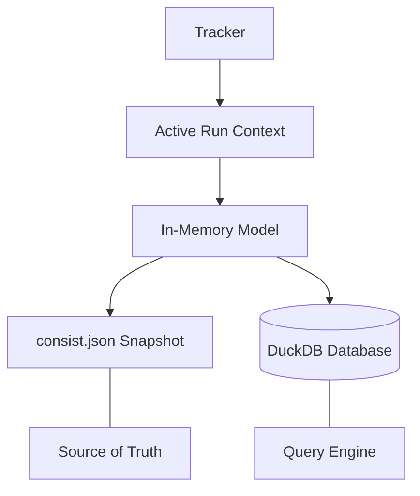

# Architecture

## How Caching Works

Consist identifies runs using a three-part signature:

```
signature = SHA256(code_hash || config_hash || input_hash)
```

| Component | Source | Notes |
|-----------|--------|-------|
| **Code hash** | Git commit SHA | Appends `-dirty-<hash>` if tracked files are modified; falls back to `unknown_code_version` without Git |
| **Config hash** | Canonical JSON of config dict | Normalized for key order and numeric types; Pydantic models serialize deterministically |
| **Input hash** | SHA256 of input content | For Consist artifacts, uses the producing run's signature (Merkle linking); for raw files, hashes bytes or metadata per `hashing_strategy` |

### What Changes Break Cache Hits?

| What Changed | Cache Hit? | Why |
|---|---|---|
| Input file content | ❌ No | File hash changes → signature changes |
| Config value | ❌ No | Config hash changes → signature changes |
| Function code | ❌ No | Code hash changes → signature changes |
| `runtime_kwargs` | ✅ Yes | runtime_kwargs are NOT hashed; don't affect signature |
| Output file names | ✅ Yes | Output names don't affect signature |
| Comments in code | Depends | Committed comment changes affect the code hash; uncommitted changes mark the repo dirty and break cache. |

**Merkle DAG structure**: Each run's signature incorporates the signatures of its input artifacts' producing runs. This forms a directed acyclic graph where:

- Changing a parameter invalidates only downstream runs that depend on it
- Identical inputs produce cache hits across machines (given the same code version)
- Provenance validity depends on the lineage graph, not file existence

For detailed terminology, see [Core Concepts](concepts/overview.md).

### Cache Modes

| Mode | Behavior |
|------|----------|
| `reuse` (default) | Return cached result if signature matches |
| `overwrite` | Always execute, update cache with new result |
| `readonly` | Use cache but don't persist new results (sandbox mode) |

### Ghost Mode

Consist enables "Ghost Mode" — the ability to delete intermediate files while preserving provenance and recoverability. As long as the provenance database records lineage and content hashes, Consist can:

- Verify that a cached result is valid (signature matches)
- Identify which upstream run produced a missing artifact
- Re-execute only the necessary steps to regenerate data (when strict cache validation is enabled)

**When You Need This**

Long-running research workflows accumulate massive intermediate datasets that you want to keep for lineage but eventually need to reclaim space. Consider a 20-year grid planning study with annual dispatch simulations:

```
Year 2025: Compute hourly dispatch → Store (200GB) → Use as input for 2026 capacity expansion
Year 2026: Compute hourly dispatch → Store (200GB) → Use as input for 2027 capacity expansion
... (20 years × 200GB = 4TB)
Year 2045: Final resource plan published
```

Once you've published results (2035–2045), you can safely delete 2025–2034 intermediate files. The provenance database still tracks what those files contained (via content hashes). If you later need to re-run 2036, Consist can:
1. Detect that 2035's output is missing from disk (via cache validation)
2. Re-run only the missing upstream steps
3. Materialize just the files needed for the downstream run

**How It Works**

When you log an artifact in Consist, three pieces of information are persisted:

- **Content hash** (SHA256 of file bytes) — Stored in the database
- **URI and metadata** — Stored as provenance
- **Actual file** — On disk (optional in Ghost Mode)

On cache hits, if a file is missing from disk, you have two recovery paths:
- **Re-execute** (recommended for non-ingested outputs) by enabling strict cache validation
- **DB recovery** (for ingested tabular outputs) via `consist.load_df(..., db_fallback="always")`

Example: recover a missing, ingested tabular artifact from DuckDB:
```python
with tracker.start_run("2036_dispatch", model="grid_sim"):
    artifact = tracker.log_artifact(
        "year_2035_dispatch.parquet", key="dispatch", direction="input"
    )
    df = consist.load_df(artifact, db_fallback="always")  # (1)!
```

1. Retrieves the 2035 dispatch data from DuckDB even though the original Parquet file was deleted. Requires the artifact to have been ingested during the original run.

Re-execution respects the same cache key (code + config + inputs), so if inputs haven't changed, Consist reuses the prior computation and materializes its output on-demand.

**Best Practices**

- Use Ghost Mode for intermediate outputs in long-running studies, not critical published results.
- Keep the provenance database (`provenance.duckdb`) on reliable storage; it's the source of truth for recovery.
- Archive deleted files alongside the database for offline recovery if needed.
- Test recovery workflows (intentional deletion + re-run or DB recovery) before relying on Ghost Mode in production.

---

## Data Model

Consist uses two core entities with a many-to-many relationship:

| Entity | Purpose |
|--------|---------|
| `Run` | Execution context: model name, config, timestamps, status, parent linkage |
| `Artifact` | File metadata: path (as URI), content hash, driver, schema reference |
| `RunArtifactLink` | Connects runs to their input and output artifacts with direction metadata |

Key fields for workflow tracking:
- `Run.parent_run_id` — Links scenario steps to their parent scenario; used as the scenario identifier in views (see `consist_scenario_id`)
- `Run.year` — Simulation year for time-series workflows
- `Run.tags` — String labels for filtering (stored as JSON array)
- `Artifact.hash` — SHA256 content hash for deduplication and verification

### Configuration Management

Consist provides three strategies for tracking configuration:

| Strategy | Use case | Stored in DB | Affects cache |
|----------|----------|--------------|---------------|
| **Identity config** (`config=`) | Standard parameters | JSON snapshot only | Yes |
| **Facet** (`facet=`) | Queryable subset | DuckDB table | No |
| **Hash-only inputs** (`hash_inputs=`) | Large config files (10MB+) | Hash only | Yes |

Most workflows combine all three: identity config for full parameters, facet for filtering, and hash-only for large external files.

For detailed usage, see [Configuration, Identity, and Facets](configs.md).

**Database tables**:

- `config_facet`: Deduplicated facet JSON, namespaced by model
- `run_config_kv`: Flattened key/value index for facet filtering
- `artifact_facet`: Deduplicated artifact-level facet JSON
- `artifact_kv`: Flattened scalar key/value index for artifact facet filtering

### Shared Facet Processing Core

Run facets and artifact facets use a shared internal processing pipeline
implemented in `src/consist/core/facet_common.py`.

Shared steps:

- normalize facet payloads (dict/Pydantic) into JSON-safe maps
- infer facet schema names from Pydantic models
- canonicalize JSON and compute stable facet IDs (SHA256)
- flatten nested keys with escaped dot notation (`.` -> `\.`)
- encode typed leaf values (`str`, `int`, `float`, `bool`, `null`, optional `json`)

Entity-specific managers (`ConfigFacetManager` and `ArtifactFacetManager`) remain
separate to preserve different persistence and query semantics while reusing the
same core flattening/hash logic.

---

## Dual-Write Persistence

Consist maintains two synchronized records for resilience:



**Write order (safety guarantee):**

1. Update in-memory model
2. Flush to `consist.json` (atomic write) ← **Source of truth**
3. Attempt DB sync (catch errors, log warning, never crash)

**JSON snapshots** (`consist.json` per run): Portable, human-readable, version-controllable. Each run directory contains a complete record that survives database corruption.

**DuckDB database**: Enables fast queries across runs, artifacts, and lineage. Can be rebuilt from JSON snapshots if needed. Handles concurrent access with retry logic.

---

## Testing & Coverage Focus

The test suite prioritizes correctness for production workflows and portability:

- Cache hydration across run directories (metadata-only, requested/all outputs, missing-input reconstruction, permission/mount issues).
- Path virtualization and mount resolution (workspace URIs, symlink handling, stale/moved run directories).
- Persistence resilience (lock retries, constraint conflict handling, JSON snapshot safety).
- Ingestion and data virtualization (DLT ingestion paths, strict schema validation, hybrid view behavior).
- CLI/query helpers for inspection workflows (filters, preview error modes).

---

## Path Virtualization

Absolute paths break portability. Consist stores relative URIs and resolves them at runtime.
For a focused guide, see [Mounts & Portability](mounts-and-portability.md).

```
User logs: /mnt/data/land_use.csv
           ↓
Tracker detects mount: mounts={"inputs": "/mnt/data"}
           ↓
Stored URI: inputs://land_use.csv
```

**Workspace URIs**: For run-specific output directories, Consist mounts the current run's directory as `workspace://`. Historical paths are resolved via metadata stored in `Run.meta["_physical_run_dir"]`.

This means:
- Provenance stays valid when data moves between machines
- Teams can share databases without path conflicts
- Cloud and local storage can coexist

---

## Data Virtualization

### SQL Views

Register SQLModel schemas to query artifacts across runs as unified tables:

```python
class Person(SQLModel, table=True):
    person_id: int = Field(primary_key=True)
    age: int

tracker = Tracker(schemas=[Person])

# Access the view
VPerson = tracker.views.Person

# Query across all runs
query = select(VPerson).where(VPerson.consist_year == 2030)
```

Views automatically include system columns:
- `consist_run_id` — Which run produced this row
- `consist_scenario_id` — Parent scenario identifier
- `consist_year` — Simulation year
- `consist_artifact_id` — Source artifact

### Hybrid Views

Consist creates "hybrid" views that union:
- **Hot data**: Rows ingested into DuckDB tables (fast queries)
- **Cold data**: Parquet/CSV files on disk (no duplication)

This lets you query terabytes of simulation output without loading everything into memory.

### Matrix Views (N-Dimensional)

For Zarr/NetCDF arrays, `MatrixViewFactory` creates lazy xarray Datasets:

1. Query the artifact catalog for matching Zarr stores
2. Open each store lazily (no data loaded)
3. Concatenate along `run_id` dimension with `year`/`iteration` as coordinates

```python
ds = tracker.matrix.load("skim_matrices", variables=["travel_time"])
# ds is an xarray.Dataset with dims: (run_id, origin, destination)
```

---

## Container Integration

Containers are treated as pure functions. The cache signature includes:

```
signature = SHA256(image_digest || command || env_hash || mount_hashes || input_signatures)
```

| Condition | Behavior |
|-----------|----------|
| Cache hit | Verify outputs exist, relink artifacts, hydrate files to host paths |
| Cache miss | Execute container, capture outputs, record image digest |

Supported backends: Docker, Singularity/Apptainer. For usage details, see [Container Integration Guide](containers-guide.md).

---

## Event Hooks

Register callbacks for run lifecycle events:

```python
tracker.events.on_run_complete(lambda run, artifacts: notify_slack(run.id))
tracker.events.on_run_failed(lambda run, error: log_to_sentry(error))
```

| Event | Callback signature |
|-------|-------------------|
| `on_run_complete` | `Callable[[Run, List[Artifact]], None]` |
| `on_run_failed` | `Callable[[Run, Exception], None]` |

Hook failures are logged but do not crash the run.

---

## Context Stack

Consist maintains a context-local stack of active trackers, allowing nested contexts and implicit tracker resolution:

```python
import consist
from consist import use_tracker

with use_tracker(tracker):
    with consist.scenario("baseline") as sc:
        # consist.log_artifact() finds the active tracker automatically
        with sc.step(name="simulate"):
            consist.log_dataframe(df, key="results")  # No tracker= needed
```

This enables clean APIs where most functions don't require explicit tracker parameters.
