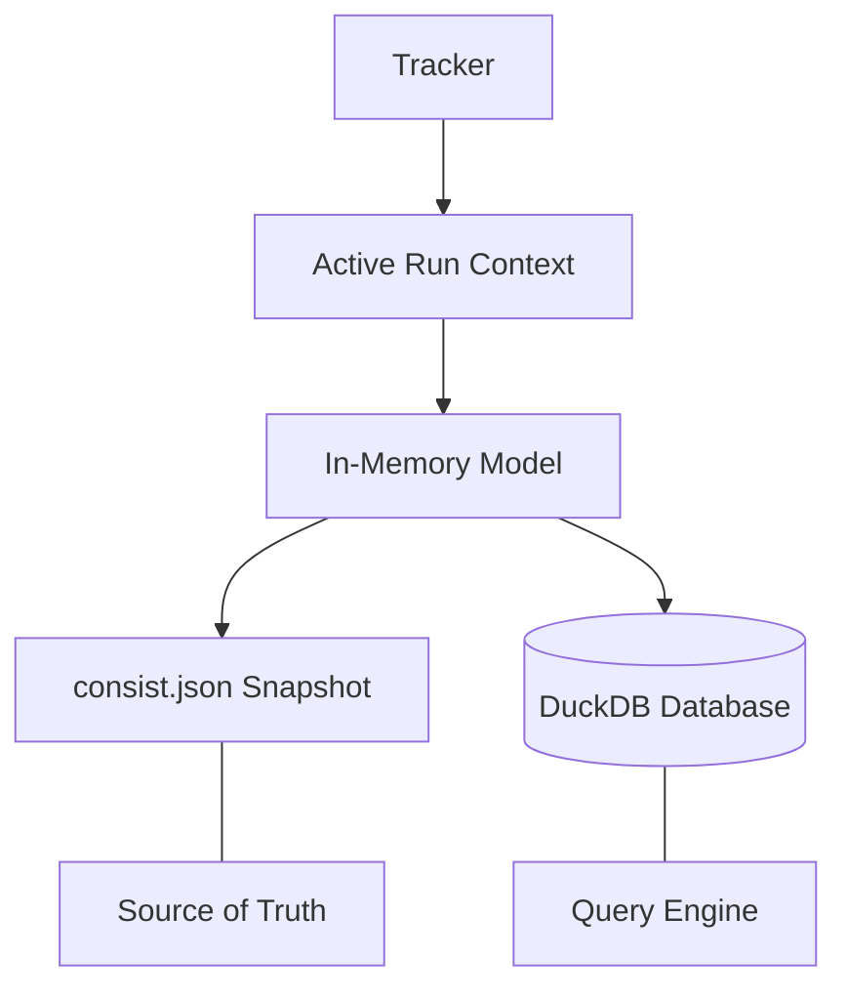

# Architecture

!!! note "Recommended path"
    For most user workflows, the recommended path is `consist.run(...)`,
    `consist.trace(...)`, or `consist.scenario(...)`. Low-level lifecycle snippets
    in this page (for example `tracker.start_run(...)` + `tracker.log_artifact(...)`)
    are advanced and primarily explain internal behavior.

## How Caching Works

Consist identifies runs using a three-part signature:

```
signature = SHA256(code_hash || config_hash || input_hash)
```

| Component | Source | Notes |
|-----------|--------|-------|
| **Code hash** | Configurable code identity | Default `repo_git` uses Git commit/dirty state; callable modes hash the function module or source |
| **Config hash** | Canonical JSON of config dict | Normalized for key order and numeric types; Pydantic models serialize deterministically |
| **Input hash** | SHA256 of input content | For Consist artifacts, uses the producing run's signature (Merkle linking); for raw files, hashes bytes or metadata per `hashing_strategy` |

### What Changes Break Cache Hits?

| What Changed | Cache Hit? | Why |
|---|---|---|
| Input file content | ❌ No | File hash changes → signature changes |
| Config value | ❌ No | Config hash changes → signature changes |
| Function code | ❌ No | Code hash changes → signature changes |
| `runtime_kwargs` | ✅ Yes | runtime_kwargs are NOT hashed; don't affect signature |
| Output file names | ✅ Yes | Output names don't affect signature |
| Comments in code | Depends | Under `repo_git`, tracked comment changes affect code hash. Under `callable_source`, only comments in the callable source matter. Under `callable_module`, comments in the callable's module matter. |

**Merkle DAG structure**: Each run's signature incorporates the signatures of its input artifacts' producing runs. This forms a directed acyclic graph where:

- Changing a parameter invalidates only downstream runs that depend on it
- Identical inputs produce cache hits across machines (given the same code version)
- Provenance validity depends on the lineage graph, not file existence

For detailed terminology, see [Core Concepts](concepts/overview.md).

### Cache Modes

| Mode | Behavior |
|------|----------|
| `reuse` (default) | Return cached result if signature matches |
| `overwrite` | Always execute, update cache with new result |
| `readonly` | Use cache but don't persist new results (sandbox mode) |

For runnable examples and migration guidance from legacy run-policy kwargs, see [Caching & Hydration](concepts/caching-and-hydration.md).

### Ghost Mode

Consist enables "Ghost Mode" — the ability to delete intermediate files while preserving provenance and recoverability. Content hashes stored in the database let Consist verify cached results, identify which upstream run produced a missing artifact, and re-execute only the steps needed to regenerate it. For the full guide including recovery patterns and best practices, see [Caching & Hydration](concepts/caching-and-hydration.md).

---

## Data Model

Consist uses two core entities with a many-to-many relationship:

| Entity | Purpose |
|--------|---------|
| `Run` | Execution context: model name, config, timestamps, status, parent linkage |
| `Artifact` | File metadata: path (as URI), content hash, driver, schema reference |
| `RunArtifactLink` | Connects runs to their input and output artifacts with direction metadata |

Key fields for workflow tracking:
- `Run.parent_run_id` — Links scenario steps to their parent scenario; used as the scenario identifier in views (see `consist_scenario_id`)
- `Run.year` — Simulation year for time-series workflows
- `Run.tags` — String labels for filtering (stored as JSON array)
- `Artifact.hash` — SHA256 content hash for deduplication and verification

Consist provides three strategies for tracking configuration: `config=` (hashed into the cache key, stored as a JSON snapshot), `facet=` (queryable in DuckDB, does not affect the cache), and `identity_inputs=` (large external files hashed into the cache key but not stored as content). For full usage, guardrails, and query examples, see [Config, Facets, and Identity Inputs](concepts/config-management.md).

---

## Dual-Write Persistence

Consist maintains two synchronized records for resilience:


```mermaid
graph TD
    Tracker[Tracker] --> Context[Active Run Context]
    Context --> Memo[In-Memory Model]
    Memo --> Snapshot[consist.json Snapshot]
    Memo --> DB[(DuckDB Database)]
    Snapshot --- Source[Source of Truth]
    DB --- Query[Query Engine]
```

**Write order (safety guarantee):**

1. Update in-memory model
2. Flush to `consist.json` (atomic write) ← **Source of truth**
3. Attempt DB sync (catch errors, log warning, never crash)

**JSON snapshots** (`consist.json` per run): Portable, human-readable, version-controllable. Each run directory contains a complete record that survives database corruption.

**DuckDB database**: Enables fast queries across runs, artifacts, and lineage. Can be rebuilt from JSON snapshots if needed. Handles concurrent access with retry logic.

---

## Path Virtualization

Absolute paths break portability. Consist stores relative URIs and resolves them at runtime.
For a focused guide, see [Mounts & Portability](mounts-and-portability.md).

```
User logs: /mnt/data/land_use.csv
           ↓
Tracker detects mount: mounts={"inputs": "/mnt/data"}
           ↓
Stored URI: inputs://land_use.csv
```

**Run-local paths**: For run-specific output directories, Consist typically stores
paths relative to the run directory (for example `./outputs/...`). Historical
resolution also accepts `workspace://...` aliases and uses metadata stored in
`Run.meta["_physical_run_dir"]`.

---

## Data Virtualization

Consist creates **hybrid views** that transparently union ingested ("hot") DuckDB rows with raw files ("cold") on disk, so you can query across runs without loading everything into memory. Register a SQLModel schema with `Tracker(schemas=[MySchema])` to activate a view that includes provenance columns (`consist_run_id`, `consist_year`, `consist_scenario_id`, `consist_artifact_id`) for filtering and grouping.

For N-dimensional data, `MatrixViewFactory` currently loads tracked **Zarr**
stores as lazy xarray Datasets concatenated along a `run_id` dimension with
`year`/`iteration` as coordinates. NetCDF metadata can still be cataloged
elsewhere in Consist, but `Tracker.load_matrix(...)` is currently Zarr-focused.

For schemas, ingestion, and query examples, see [DLT Loader Guide](dlt-loader-guide.md) and [Schema Export](schema-export.md).

---

## Container Integration

Containers are treated as pure functions. The cache signature extends the
standard formula with container-specific components including image digest,
command, environment hash, backend, working directory, declared host `volumes`,
and backend-specific extra args:

```
signature = SHA256(container_config || input_signatures)
```

Current caveat: because the container config includes resolved host volume
paths, cross-machine cache reuse requires those host roots to stay stable too.
Changing `/shared/team_inputs` to `/mnt/nfs/team_inputs` changes the signature
even if the in-container mount point remains `/inputs`.

Supported backends: Docker, Singularity/Apptainer. For usage details, see [Container Integration Guide](containers-guide.md).

---

## Event Hooks

Consist exposes `on_run_complete` and `on_run_failed` callbacks for external integrations (notifications, OpenLineage, etc.). Hook failures are logged but never crash the run. See [API Reference](api/advanced.md) for callback signatures and registration.

---

## Context Stack

Consist maintains a context-local stack of active trackers, allowing nested contexts and implicit tracker resolution:

```python
import consist
from consist import use_tracker

with use_tracker(tracker):
    with consist.scenario("baseline") as sc:
        # consist.log_artifact() finds the active tracker automatically
        with sc.step(name="simulate"):
            consist.log_dataframe(df, key="results")  # No tracker= needed
```

This enables clean APIs where most functions don't require explicit tracker parameters.
