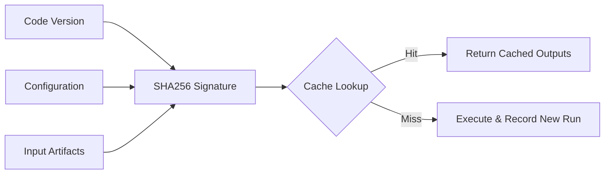
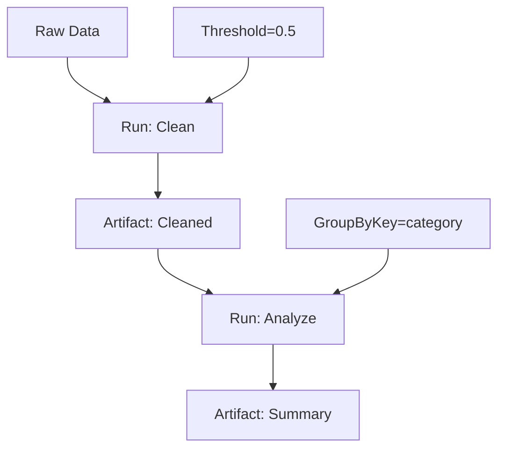

# Core Concepts Overview

This section establishes the mental model for Consist before covering API details.

---

## Core Abstractions

**Artifact**: A file with provenance metadata—its path, format, content hash (SHA256), producing run, and ingestion status.

**Run**: A single execution with tracked inputs, configuration, outputs, status, and timing. Each run has a signature computed from code, config, and inputs that enables cache reuse.

**Scenario**: A parent run grouping related child runs for multi-variant studies or iterative workflows.

**Coupler**: A helper that passes artifacts between steps in a scenario, linking lineage automatically.

---

## How Caching Works

Consist computes a signature from code version, config, and input artifact hashes:



Same signature → return cached outputs. Different signature → execute and record new lineage.

On cache hits, Consist returns output artifact metadata without copying files. Load or hydrate outputs when you need bytes.

**Example**: In a parameter sweep testing 20 demand elasticity values, the first run executes preprocessing and the demand model. Runs 2–20 cache-hit on preprocessing (same inputs, same code) but cache-miss on the demand model (different elasticity). Consist skips 19 preprocessing executions.

---

## Provenance & Lineage

**Provenance**: The complete history of a result—code version, configuration, input data, and compute environment. Consist records provenance automatically for every run.

**Lineage**: The dependency chain showing which run created an artifact, which inputs that run consumed, and which runs produced those inputs.



Provenance answers three questions: *Can I re-run this exactly?* (reproducibility), *Which config produced this figure?* (accountability), and *Why did this change?* (debugging).

**Example**: You published a land-use forecast. A reviewer asks which scenario produced Figure 3. Run `consist show <run_id>` to see the code version (commit SHA), config parameters, input parcel data, and execution timestamp.

---

## Key Terms (Dependency-Ordered)

### Identity & Caching Foundation

**Signature**: A fingerprint of a run computed by hashing code version, configuration, and input data.

**Canonical Hashing**: Converting configuration data into a deterministic fingerprint regardless of field order or number formatting—`{"a": 1, "b": 2}` and `{"b": 2, "a": 1}` produce the same hash.

**Merkle DAG**: A graph structure where each step's inputs link to previous steps' outputs, creating an immutable lineage record that enables cache validation and data recovery.

### Configuration & Querying

**Config**: Parameters that affect computation and are included in the cache signature; changing config triggers re-execution.

**Identity Config**: The subset of configuration parameters that affect a run's cache signature.

**Facet**: A queryable subset of configuration (e.g., `{"year": 2030, "scenario": "baseline"}`) indexed in DuckDB for filtering runs without affecting caching.

### Cache Behavior

**Cache Hit**: Consist finds a previous run with identical signature and returns cached artifact metadata.

**Cache Miss**: No matching cached result exists; the function executes and outputs are recorded as new artifacts.

**Hydration**: Recovering metadata and location information about a previous run's output without copying file bytes. Hydration ≠ copying files.

### Data Storage & Recovery

**Ingestion**: Loading artifact data into DuckDB for SQL-native analysis.

**Materialization**: Copying artifact bytes into DuckDB so data is recoverable if original files are deleted.

**Ghost Mode**: Recovering artifacts from DuckDB when physical files no longer exist.

### Data Virtualization

**Virtualization**: Querying multiple artifacts as a single table without loading all data into memory.

**Hybrid View**: A SQL view combining hot data (ingested into DuckDB) with cold data (read from files on-the-fly).

### Data Types

**Cold Data**: File-based data on disk; provenance is tracked but data is not queryable via SQL until ingested.

**Hot Data**: Data ingested into DuckDB for SQL queries, schema tracking, and optional recovery.

### Integrations & Extensions

**DLT (Data Load Tool)**: A Python library for loading data into warehouses; Consist uses DLT to ingest artifacts with provenance columns.

**Coupler**: A pattern for multi-step workflows that passes artifacts between steps and links lineage through scenario trees.

**Trace**: The execution path through a multi-step workflow showing which runs executed, which cache-hit, and which artifacts were passed.

---

## How Inputs and Outputs Are Treated

**Inputs** are files or values that influence computation. File inputs are hashed by content or metadata depending on the hashing strategy (`full` vs `fast`).

**Outputs** are named artifacts declared via `consist.run(...)` or `tracker.run(...)`. Consist stores their paths and provenance metadata for lookup and querying.

Write outputs under `tracker.run_dir` or a mounted `outputs://` root. This keeps artifact paths relative and portable across machines.

### Input mappings and auto-loading

Inputs can be passed as a list (hash-only) or a mapping (hash + parameter injection). When using a mapping, Consist matches input keys to function parameters and auto-loads artifacts by default. To pass raw paths instead, set `load_inputs=False` and provide paths via `runtime_kwargs`.

Concrete example:

``` python
import pandas as pd

def summarize_trips(trips_df):
    return trips_df["distance_miles"].mean()

result = consist.run(  # (1)!
    fn=summarize_trips,
    inputs={"trips_df": trips_artifact},
)

def summarize_trips_from_path(trips_path: str):
    df = pd.read_parquet(trips_path)
    return df["distance_miles"].mean()

result = consist.run(  # (2)!
    fn=summarize_trips_from_path,
    inputs={"trips_path": trips_artifact},
    load_inputs=False,
    runtime_kwargs={"trips_path": trips_artifact.path},
)
```

1. Auto-loading: mapping keys match function params, so Consist loads the DataFrame.
2. No auto-loading: you get the raw path and load it yourself.

---

## Next Steps

- **[Config Management](config-management.md)** — Understand the config vs. facet distinction and when to use each
- **[Caching & Hydration](caching-and-hydration.md)** — Caching patterns and data recovery strategies
- **[Data Materialization](data-materialization.md)** — When to ingest data and use hybrid views
- **[Decorators & Metadata](decorators-and-metadata.md)** — Defaults, templates, and schema introspection
