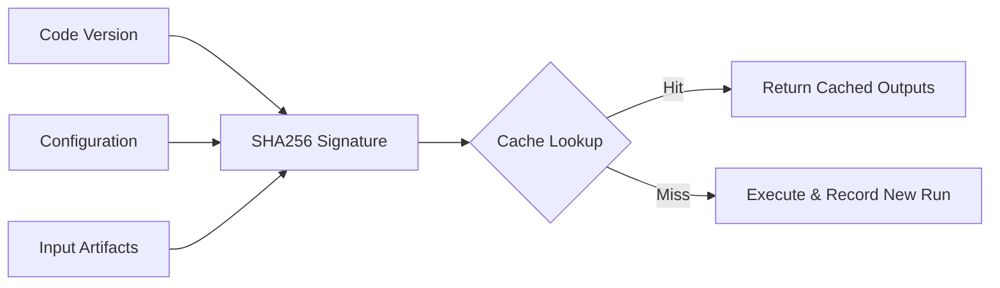
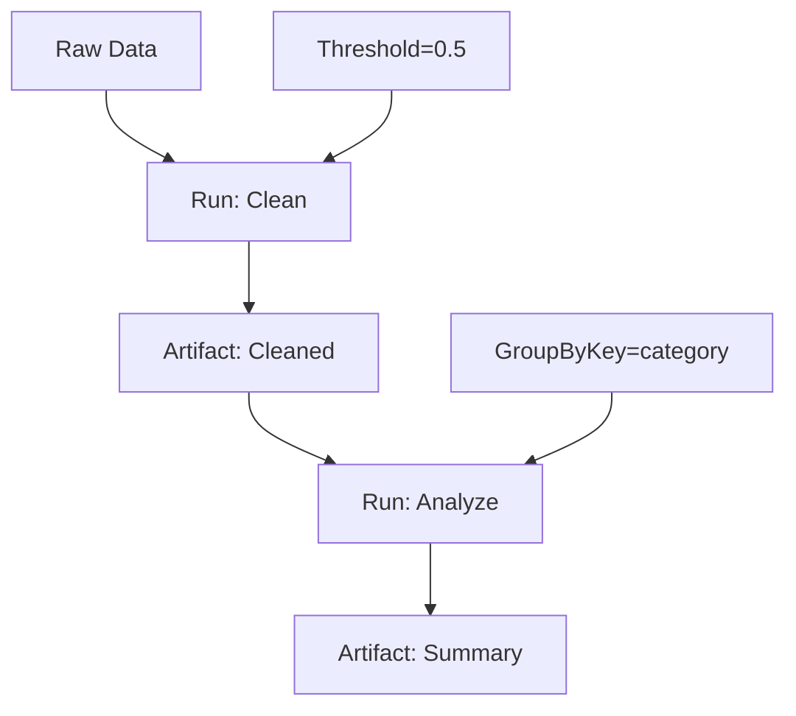

# Core Concepts Overview

This section establishes the mental model for Consist before covering API details.

---

## Core Abstractions

**Artifact**: A file with provenance metadata—its path, format, content hash (SHA256), producing run, and ingestion status.

**Run**: A single execution with tracked inputs, configuration, outputs, status, and timing. Each run has a signature computed from code, config, and inputs that enables cache reuse.

**Scenario**: A parent run grouping related child runs for multi-variant studies or iterative workflows.

**Coupler**: A helper that passes artifacts between steps in a scenario, linking lineage automatically.

---

## How Caching Works

Consist computes a signature from code version, config, and input artifact hashes:


```mermaid
graph LR
    Code[Code Version] --> Hash[SHA256 Signature]
    Config[Configuration] --> Hash
    Inputs[Input Artifacts] --> Hash
    Hash --> Lookup{Cache Lookup}
    Lookup -->|Hit| Return[Return Cached Outputs]
    Lookup -->|Miss| Execute[Execute & Record New Run]
```

Same signature → return cached outputs. Different signature → execute and record new lineage.

On cache hits, Consist returns output artifact metadata without copying files. Load or hydrate outputs when you need bytes.

**Example**: In a parameter sweep testing 20 demand elasticity values, the first run executes preprocessing and the demand model. Runs 2–20 cache-hit on preprocessing (same inputs, same code) but cache-miss on the demand model (different elasticity). Consist skips 19 preprocessing executions.

---

## Provenance & Lineage

**Provenance**: The complete history of a result—code version, configuration, input data, and compute environment. Consist records provenance for every tracked run.

**Lineage**: The dependency chain showing which run created an artifact, which inputs that run consumed, and which runs produced those inputs.


```mermaid
graph TD
    Raw[Raw Data] --> Step1[Run: Clean]
    Config1[Threshold=0.5] --> Step1
    Step1 --> Art1[Artifact: Cleaned]
    Art1 --> Step2[Run: Analyze]
    Config2[GroupByKey=category] --> Step2
    Step2 --> Art2[Artifact: Summary]
```

Provenance answers three questions: *Can I re-run this exactly?* (reproducibility), *Which config produced this figure?* (accountability), and *Why did this change?* (debugging).

**Example**: You published a land-use forecast. A reviewer asks which scenario produced Figure 3. Run `consist show <run_id>` to see the code version (commit SHA), config parameters, input parcel data, and execution timestamp.

---

## Canonical Terms (Quick Reference)

This page keeps one-line canonical definitions. Detailed behavior and policies
live in the linked specialized pages.

| Term | Definition | Deep dive |
|---|---|---|
| **Signature** | Fingerprint of code + config + inputs used for cache lookup. | [Caching & Hydration](caching-and-hydration.md) |
| **Facet** | Queryable metadata subset used for filtering runs (not cache identity). | [Config Management](config-management.md) |
| **Cache hit / miss** | Hit reuses prior completed outputs; miss executes and records new lineage. | [Caching & Hydration](caching-and-hydration.md) |
| **Hydration** | Recover artifact metadata/paths without copying bytes. | [Caching & Hydration](caching-and-hydration.md) |
| **Materialization** | Ensure bytes exist in a target location (filesystem or DB path). | [Data Materialization](data-materialization.md) |
| **Cold / hot data** | Cold stays file-based; hot is ingested into DuckDB for SQL queries. | [Data Materialization](data-materialization.md) |
| **Hybrid view** | SQL view that combines ingested rows with file-backed rows. | [Data Materialization](data-materialization.md) |
| **Ghost mode** | Recovery path when files are missing but provenance/ingestion exists. | [Caching & Hydration](caching-and-hydration.md) |
| **Coupler** | Scenario helper for passing step outputs to downstream inputs. | [Decorators & Metadata](decorators-and-metadata.md) |

For a full term index, see the [Glossary](../glossary.md).

---

## How Inputs and Outputs Are Treated

**Inputs** are files or values that influence computation. File inputs are hashed by content or metadata depending on the hashing strategy (`full` vs `fast`).

**Outputs** are named artifacts registered via a function's `dict[str, Path]`
return value together with declared `outputs=[...]`, or explicitly via
`output_paths`. Consist stores their paths and provenance metadata for lookup
and querying.

### Recommended pattern: file-based I/O

The recommended pattern is for functions to accept file paths as inputs, write
output files, and return a `dict[str, Path]` mapping artifact keys to output
paths. Declare the matching artifact keys in `outputs=[...]` when calling
`tracker.run(...)`; Consist then logs those returned paths as artifacts.

``` python
import pandas as pd
from pathlib import Path

def summarize_trips(trips_path: Path) -> dict[str, Path]:
    df = pd.read_parquet(trips_path)
    out = Path("./summary.parquet")
    df.groupby("mode")["distance_miles"].mean().to_frame().to_parquet(out)
    return {"summary": out}

result = tracker.run(
    fn=summarize_trips,
    inputs={"trips_path": trips_artifact},  # path resolved from artifact; hashed for cache identity
    outputs=["summary"],
)
```

The function is a plain Python callable: testable without a tracker, honest about its I/O, and readable without framework knowledge.

### When to use `output_paths`

If a function writes files but returns `None` (e.g., a legacy tool or subprocess wrapper), register outputs explicitly:

``` python
result = tracker.run(
    fn=run_legacy_model,
    inputs={"config": config_artifact},
    output_paths={"results": Path("./model_output.csv")},
)
```

### Auto-loading inputs as DataFrames

If you prefer to receive a DataFrame directly instead of a path, use `input_binding="loaded"` and Consist will load the artifact for you before calling the function. This is convenient for short scripts but hides the I/O boundary — prefer `input_binding="paths"` for pipelines where the function boundary matters.

---

## Next Steps

- **[Usage Guide](../usage-guide.md)** — Practical patterns for moving from the mental model to working code
- **[Config Management](config-management.md)** — Understand the config vs. facet distinction and when to use each
- **[Caching & Hydration](caching-and-hydration.md)** — Caching patterns and data recovery strategies
- **[Data Materialization](data-materialization.md)** — When to ingest data and use hybrid views
- **[Grouped Views](grouped-views.md)** — Build one view across schema-matched artifacts
- **[Decorators & Metadata](decorators-and-metadata.md)** — Defaults, templates, and schema introspection
